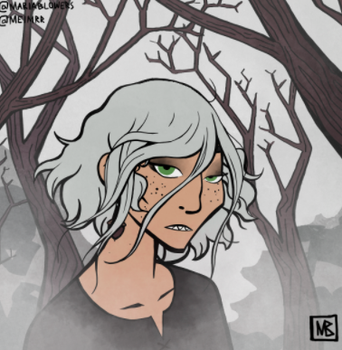

>## Alphonse Steele

--- 

#### Information

Originally very rich and from [Obol](../../Locations/Obol.md), but no longer so (as of 1 year ago \[Session 28\]). Family has a farm in [Green Orchard](../../Locations/Green%20Orchard.md). Has mentioned having private tutors. Capitalist. From the Oore family. Was thought to be dead? (source: [Percival Rosa](../NPCs/Percival%20Rosa.md)). Knows a bit about drugs. Has a bounty on his head. Fiance of [Lilianna](../NPCs/Lilianna.md) as of 1 year 2 months ago. Assassins began hunting him and his family 1 year ago.

>Gildas: 15000 G

##### Outfit

A full outfit including corset, skirt, slip, cloak, belt, leggings, bracers, boots. Dominant colors are indigo and crimson. Dominant fabric is silk. Corset is indigo silk and riveted iron in place of bone. Unusually flexible, it allows for movement, but the iron is not spaced for protection. The corset does not cover the chest, as it is designed to be worn with the slip, as well as to accommodate wearers with or without breasts. The skirt is cut to appear as an extension of the corset while the belt is worn. The pattern created by the iron is continued by silvered silk decorated with gold studs, extending to and wrapping around the hem. The indigo is patterned with crimson creating the effect of reaching hands after some time observing. The skirt reaches down to the knee, splitting halfway down the thigh on either side. The slip is a pale brown, almost cream. Designed as an inner garment, it is only shown off above the corset and below the cloak. The cloak is predominantly red silk, hemmed with silver and lined with indigo. It has a high collar and reaches down to the elbow. The collar is linked by a silver chain. The belt is simple but fine brown leather. The clasp is polished ivory. The leggings are black fabric, loose enough for comfort. Designed to cover the wearer under the skirt rather than aesthetically stand out. The bracers are worked brass, decoratively formed into continuous wrought shapes. They fit the wearer with just enough give for normal movement, and thus are not put on normally; instead the wearer slaps the bracer against their wrist and it snaps on. The boots are sky blue suede. The skirt had been tailored slightly longer and the slip is now see-through blue.

(Full outfit purchased from [Ligne Argentée](../../Locations/Siege%20Richesse.md#Ligne%20Argentée) )

#### Family

- Fredrick (younger brother)
- Ellie (younger sister)
- Lillith (mother)
- [Aildinim Oore](../NPCs/Aildinim%20Oore.md) (father)
- [Rabbit](../../Religion/Pantheon%20I/Rabbit.md) (paternal grandmother)

#### Fun Quotes

- "I will remain a cat" 
- "I'm going to disguise myself as just some guy"
- "I will haunt you even if you kill me"
- "I'm putting the centipedes in my pockets"

#### Other

~~gaslight gatekeep girlboss mansplain~~ **manipulate** ~~malewife~~
