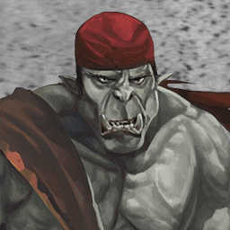

>## Cusdakesh Greyskull

--- 

#### Information

Pirate from SE Ashanti. Wanted for piracy, murder, etc. Captain of the Rockrose. Drinks Bumbos (pirate cocktail consisting of rum, water, sugar). His ship sank around 6 months ago. Legally stripped of his last name. Might be able to breakdance :) .

>Gildas: 2975 G

##### Outfit

- A black cape lined with rich purple velvet. A series of silvered buttons down one side are purely decorative. The cape’s collar is fastened with an amethyst clasp set in a black metal that remains cold to the touch no matter how long one remains in contact with it.  (purchased from [Ligne Argentée](../../Locations/Siege%20Richesse.md#Ligne%20Argentée) )
- A pair of dark brown leather boots with inch-and-a-half heels. They reach up to the thigh. When the leg is fully extended, they appear normal. With the knee fully bent, the leather appears to split, revealing a dark red eye on the side of each boot and a mouth along the arch. (purchased from [Ligne Argentée](../../Locations/Siege%20Richesse.md#Ligne%20Argentée) )

#### Fun Quotes

- "A sailor can be trained, an ocean man is born"
- "Every sailor has his secrets"
- "Every sailor has his story"
- "Every pirate has a lucky object" (if you don't, your ship will sink)
- "A pirate never turns down a drink"
- "Ale is the best smell, second only to the sea."

#### Other

~~gaslight gatekeep girlboss~~ **mansplain** ~~manipulate malewife~~
