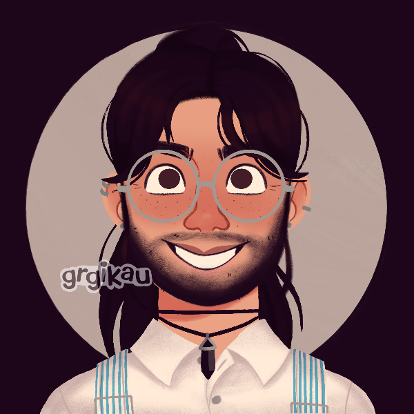

>## Eugine Brawnanvil

--- 

#### Information

Does not drink water. Map enthusiast. Apple juice enthusiast. Owns [Ghosts of Iron](../../Books/Ghosts%20of%20Iron.md). Gave up the ending of [For God or Love](../../Books/For%20God%20or%20Love.md) to [Duke Delight](../NPCs/Duke%20Delight.md) in exchange for escape. Worships [Bondye](../../Religion/Pantheon%20I/Bondye.md). Can forge stuff. His dreams look like the covers of romance novels with shirtless men on horses. Has IBS.

"has had some kiss kiss"

>Gildas: 2785 G

##### Outfit

An ochre and umber kilt. Thick but breathable wool. A deceptive amount of give, so if the wearer spins around it flares dramatically. A light yellow silk shirt. Only buttons halfway up the chest. Flowy sleeves. A dark red, almost brown leather jacket. Rawhide with fringe across the shoulders and hem. A thick brown belt with a buckle bearing an iron symbol of Bondye the Forge-God. A cherry red bolo tie set with a cut carnelian. A pair of calf-length brown boots with half-inch heels. The sides and toe are embroidered in a derby style.

(Full outfit purchased from [Ligne Argentée](../../Locations/Siege%20Richesse.md#Ligne%20Argentée) )

#### Fun Quotes

- "Eugine sounds like he could be a kitchen"
- "Eugine is into DILFs" (despite being allegedly straight)
- "OTWM, what's your penis situation?"
- "Tallest dwarf in the dwarfanage"

#### Other

~~gaslight gatekeep~~ **girlboss** ~~mansplain manipulate malewife~~