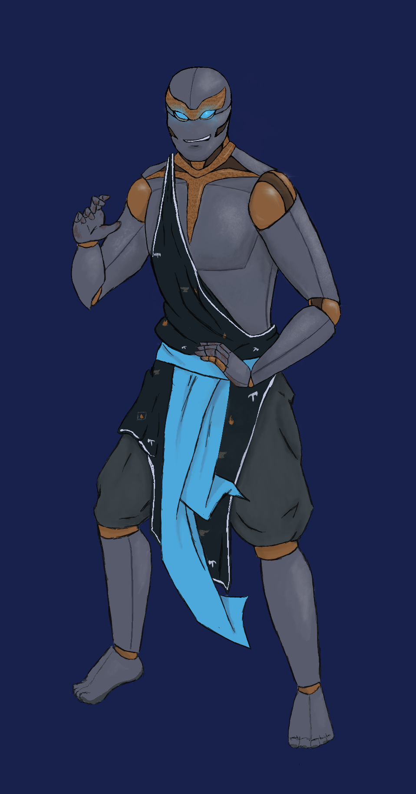

>## O.T.W.M.

--- 

#### Information

Has memories of someone important to him? But gave up his memory of what she looks like (and where her grave is?) to escape [The Duke Delight](../NPCs/Duke%20Delight.md). From the Banyan Confederacy. A 3000-series. Follows [The Penitent of Iron](../../Religion/Pantheon%20II/The%20Penitent%20of%20Iron.md).

>Gildas: 3895 G

##### Outfit

A full robe plus trousers, wrap, slippers. The dominant colors are royal blue and white, dominant fabric is linen. The robe hangs around the wearer’s shoulders’, open to their sternum exposing the collarbones. It bears repeating eye motifs picked out in periwinkle over the sleeves, which end at the bicep, down the main body of the robe, which cuts off at the thigh, and down the long panels reaching the ankle in the front and back. The trousers are loose, designed to be taken in at the ankle with leg wraps. A creamy off-white, they allow freedom of movement in all angles. The wrap is a dark maroon, primarily meant to be tied around the waist like a belt but also usable as a shawl or cloak. The leg wraps match and are cut from the same cloth. The slippers are golden in color on top, black on the bottom. They’re designed to be worn without socks, and are comfortable enough to run in.

(Full outfit purchased from [Ligne Argentée](../../Locations/Siege%20Richesse.md#Ligne%20Argentée) )

#### Fun Quotes

- \*dying in every combat*

#### Other

~~gaslight gatekeep girlboss mansplain manipulate~~ **malewife**