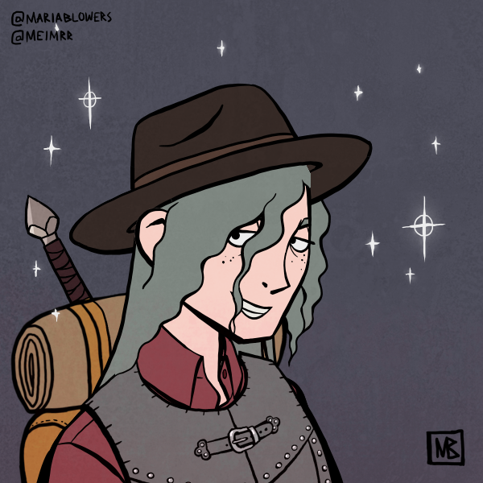
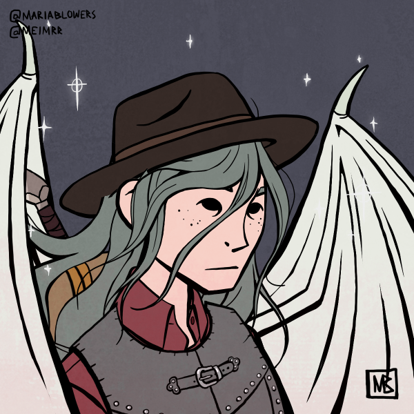
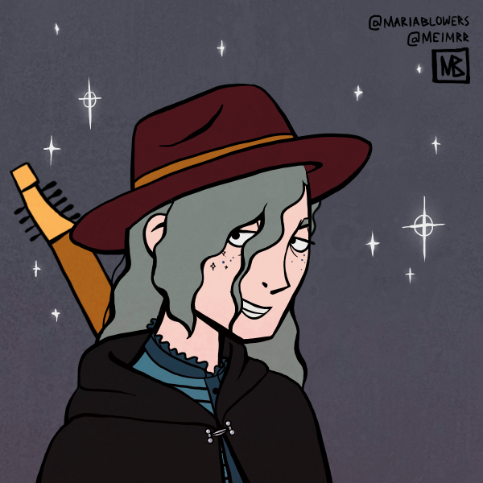
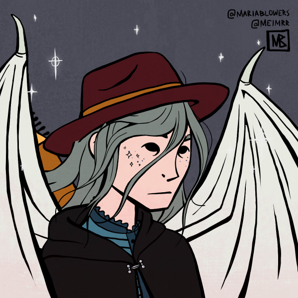

>## Quentin Thexius

--- 

(^Last updated during Session 31)

#### Information

Aasimar of [The Lawbreaker](../../Religion/Pantheon%20III/The%20Lawbreaker.md). Born in the Westergoth Empire. Used to be part of a church (religous sect)(church of miseries - [Pantheon III](../../Religion/Pantheons.md)) but ran away because he hated it ("you could say I left illegally"). His church beheaded followers of Impera. Performed with [Sextus Sergius](../NPCs/Sextus%20Sergius.md) for a while after - met them in a bar and convinced them to let him join their band. Got seperated from his group (they ran away from him) at the border of [Gardena](../../Locations/Gardena.md) and ended up wandering to [Green Orchard](../../Locations/Green%20Orchard.md). Has a tattoo bought from Super Freaky during Session 34, allowing him to summon a familiar (a rat named Pickle). Does not wash his hands before cooking (not surprising giving his reluctance to bathe). Missing his right leg from the knee down due to dying (Session 50).

Knows [Cornelia Belrose](../NPCs/Cornelia%20Belrose.md).

Has a recurring dream about singing a lullaby to a dog.

Favorite color is green.

>Gildas: 3815 G

##### Outfit

- An ankle-length crimson georgette skirt, the fabric seemingly slashed to reveal a bright scarlet beneath. The slashes form a spiral pattern down the length of the skirt that shifts with movement, making it difficult to tell exactly how many layers of fabric there are. The slashes are sewn together with silver thread embellished with pearls. (purchased from [Ligne Argentée](../../Locations/Siege%20Richesse.md#Ligne%20Argentée) )
- A black cape lined with rich purple velvet. A series of silvered buttons down one side are purely decorative. The cape’s collar is fastened with an amethyst clasp set in a black metal that remains cold to the touch no matter how long one remains in contact with it. (purchased from [Ligne Argentée](../../Locations/Siege%20Richesse.md#Ligne%20Argentée) )
- A hip-length azure damask doublet, patterned with diamond-shapes of richer, deeper blues, sapphires stitched into each fastener along the cuffs and neck. The fasteners run up the side rather than the front. (purchased from [Ligne Argentée](../../Locations/Siege%20Richesse.md#Ligne%20Argentée) )
- Shoes - periwinkle flat slippers (purchased from [Ligne Argentée](../../Locations/Siege%20Richesse.md#Ligne%20Argentée) )

#### Fun Quotes

- "I can't walk in heels. Don't tell anybody"
- "I'm gonna play with my rat"

#### Other

**gaslight** ~~gatekeep girlboss mansplain manipulate malewife~~

##### Performances
- Session 72: (26) Performed at [The Silver Star](../../Locations/Green%20Orchard.md#The%20Silver%20Star) before giving our speech about [Guard Green Orchard](../../Quests/Guard%20Green%20Orchard.md)
- Session 45: (dirty 20) Performed at [The Good Night](../../Locations/Siege%20Richesse.md#The%20Good%20Night) . Plays grunge music. Crowd loves it.
- Session 31: (2?) Attempted to perform at [The Good Night](../../Locations/Siege%20Richesse.md#The%20Good%20Night) . Was too intoxicated and fell off the stage (was maybe pushed) before playing anything.
- Session 27: (nat 20) A tavern in [Souhold](../../Locations/Souhold.md). One of the best performance he has ever done.